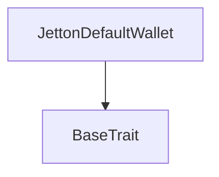
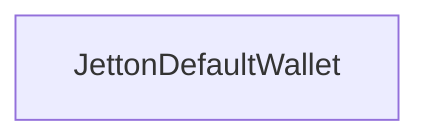

# TACT Compilation Report
Contract: JettonDefaultWallet
BOC Size: 2496 bytes

# Types
Total Types: 32

## StateInit
TLB: `_ code:^cell data:^cell = StateInit`
Signature: `StateInit{code:^cell,data:^cell}`

## StdAddress
TLB: `_ workchain:int8 address:uint256 = StdAddress`
Signature: `StdAddress{workchain:int8,address:uint256}`

## VarAddress
TLB: `_ workchain:int32 address:^slice = VarAddress`
Signature: `VarAddress{workchain:int32,address:^slice}`

## Context
TLB: `_ bounced:bool sender:address value:int257 raw:^slice = Context`
Signature: `Context{bounced:bool,sender:address,value:int257,raw:^slice}`

## SendParameters
TLB: `_ bounce:bool to:address value:int257 mode:int257 body:Maybe ^cell code:Maybe ^cell data:Maybe ^cell = SendParameters`
Signature: `SendParameters{bounce:bool,to:address,value:int257,mode:int257,body:Maybe ^cell,code:Maybe ^cell,data:Maybe ^cell}`

## ChangeOwner
TLB: `change_owner#819dbe99 queryId:uint64 newOwner:address = ChangeOwner`
Signature: `ChangeOwner{queryId:uint64,newOwner:address}`

## ChangeOwnerOk
TLB: `change_owner_ok#327b2b4a queryId:uint64 newOwner:address = ChangeOwnerOk`
Signature: `ChangeOwnerOk{queryId:uint64,newOwner:address}`

## Deploy
TLB: `deploy#946a98b6 queryId:uint64 = Deploy`
Signature: `Deploy{queryId:uint64}`

## DeployOk
TLB: `deploy_ok#aff90f57 queryId:uint64 = DeployOk`
Signature: `DeployOk{queryId:uint64}`

## FactoryDeploy
TLB: `factory_deploy#6d0ff13b queryId:uint64 cashback:address = FactoryDeploy`
Signature: `FactoryDeploy{queryId:uint64,cashback:address}`

## JettonData
TLB: `_ total_supply:int257 mintable:bool owner:address content:^cell wallet_code:^cell = JettonData`
Signature: `JettonData{total_supply:int257,mintable:bool,owner:address,content:^cell,wallet_code:^cell}`

## JettonWalletData
TLB: `_ balance:int257 owner:address master:address code:^cell = JettonWalletData`
Signature: `JettonWalletData{balance:int257,owner:address,master:address,code:^cell}`

## TokenTransfer
TLB: `token_transfer#0f8a7ea5 query_id:uint64 amount:coins destination:address response_destination:Maybe address custom_payload:Maybe ^cell forward_ton_amount:coins forward_payload:remainder<slice> = TokenTransfer`
Signature: `TokenTransfer{query_id:uint64,amount:coins,destination:address,response_destination:Maybe address,custom_payload:Maybe ^cell,forward_ton_amount:coins,forward_payload:remainder<slice>}`

## TokenTransferInternal
TLB: `token_transfer_internal#178d4519 query_id:uint64 amount:coins from:address response_destination:Maybe address forward_ton_amount:coins forward_payload:remainder<slice> = TokenTransferInternal`
Signature: `TokenTransferInternal{query_id:uint64,amount:coins,from:address,response_destination:Maybe address,forward_ton_amount:coins,forward_payload:remainder<slice>}`

## TokenNotification
TLB: `token_notification#7362d09c query_id:uint64 amount:coins from:address forward_payload:remainder<slice> = TokenNotification`
Signature: `TokenNotification{query_id:uint64,amount:coins,from:address,forward_payload:remainder<slice>}`

## TokenBurn
TLB: `token_burn#595f07bc query_id:uint64 amount:coins response_destination:Maybe address custom_payload:Maybe ^cell = TokenBurn`
Signature: `TokenBurn{query_id:uint64,amount:coins,response_destination:Maybe address,custom_payload:Maybe ^cell}`

## TokenBurnNotification
TLB: `token_burn_notification#7bdd97de query_id:uint64 amount:coins sender:address response_destination:Maybe address = TokenBurnNotification`
Signature: `TokenBurnNotification{query_id:uint64,amount:coins,sender:address,response_destination:Maybe address}`

## TokenExcesses
TLB: `token_excesses#d53276db query_id:uint64 = TokenExcesses`
Signature: `TokenExcesses{query_id:uint64}`

## TokenUpdateContent
TLB: `token_update_content#af1ca26a content:^cell = TokenUpdateContent`
Signature: `TokenUpdateContent{content:^cell}`

## ProvideWalletAddress
TLB: `provide_wallet_address#2c76b973 query_id:uint64 owner_address:address include_address:bool = ProvideWalletAddress`
Signature: `ProvideWalletAddress{query_id:uint64,owner_address:address,include_address:bool}`

## TakeWalletAddress
TLB: `take_wallet_address#d1735400 query_id:uint64 wallet_address:address owner_address:remainder<slice> = TakeWalletAddress`
Signature: `TakeWalletAddress{query_id:uint64,wallet_address:address,owner_address:remainder<slice>}`

## ClaimUserReward
TLB: `claim_user_reward#e35846ae base_rate:uint64 growth_rate:uint64 = ClaimUserReward`
Signature: `ClaimUserReward{base_rate:uint64,growth_rate:uint64}`

## ClaimAndLock
TLB: `claim_and_lock#3855930d amount:coins = ClaimAndLock`
Signature: `ClaimAndLock{amount:coins}`

## ClaimAndLockUser
TLB: `claim_and_lock_user#0f016de5 amount:coins base_rate:uint64 growth_rate:uint64 = ClaimAndLockUser`
Signature: `ClaimAndLockUser{amount:coins,base_rate:uint64,growth_rate:uint64}`

## ClaimNotification
TLB: `claim_notification#9b126c9a user_address:address amount:coins = ClaimNotification`
Signature: `ClaimNotification{user_address:address,amount:coins}`

## LockNotification
TLB: `lock_notification#b41ed4c2 user_address:address amount:coins = LockNotification`
Signature: `LockNotification{user_address:address,amount:coins}`

## Vote
TLB: `vote#a08a5346 base_rate:uint32 growth_rate:uint32 = Vote`
Signature: `Vote{base_rate:uint32,growth_rate:uint32}`

## VoteNotification
TLB: `vote_notification#b024a479 amount:coins base_rate:uint32 growth_rate:uint32 = VoteNotification`
Signature: `VoteNotification{amount:coins,base_rate:uint32,growth_rate:uint32}`

## MaxRates
TLB: `max_rates#0ec61161 base_rate:uint32 growth_rate:uint32 = MaxRates`
Signature: `MaxRates{base_rate:uint32,growth_rate:uint32}`

## Mint
TLB: `mint#fc708bd2 amount:int257 receiver:address = Mint`
Signature: `Mint{amount:int257,receiver:address}`

## Stom$Data
TLB: `null`
Signature: `null`

## JettonDefaultWallet$Data
TLB: `null`
Signature: `null`

# Get Methods
Total Get Methods: 1

## get_wallet_data

# Error Codes
2: Stack underflow
3: Stack overflow
4: Integer overflow
5: Integer out of expected range
6: Invalid opcode
7: Type check error
8: Cell overflow
9: Cell underflow
10: Dictionary error
11: 'Unknown' error
12: Fatal error
13: Out of gas error
14: Virtualization error
32: Action list is invalid
33: Action list is too long
34: Action is invalid or not supported
35: Invalid source address in outbound message
36: Invalid destination address in outbound message
37: Not enough TON
38: Not enough extra-currencies
39: Outbound message does not fit into a cell after rewriting
40: Cannot process a message
41: Library reference is null
42: Library change action error
43: Exceeded maximum number of cells in the library or the maximum depth of the Merkle tree
50: Account state size exceeded limits
128: Null reference exception
129: Invalid serialization prefix
130: Invalid incoming message
131: Constraints error
132: Access denied
133: Contract stopped
134: Invalid argument
135: Code of a contract was not found
136: Invalid address
137: Masterchain support is not enabled for this contract
4429: Invalid sender
9511: amount exceeds balance
16059: Invalid value
18668: Can't Mint Anymore
34913: exceed max growth rate.
39579: Exceed max supply
41223: no reward
42439: exceed max base rate.
42708: Invalid sender!
43422: Invalid value - Burn
51462: vote is not allowed
62972: Invalid balance

# Trait Inheritance Diagram

# Contract Dependency Diagram

